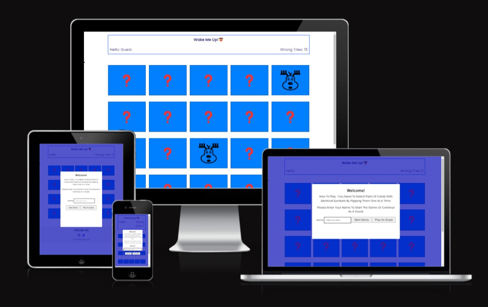
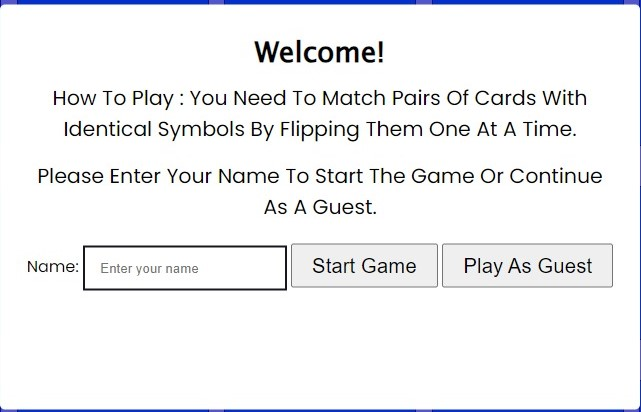
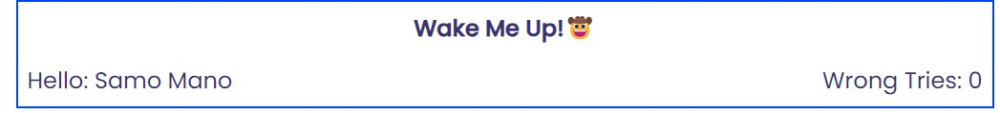
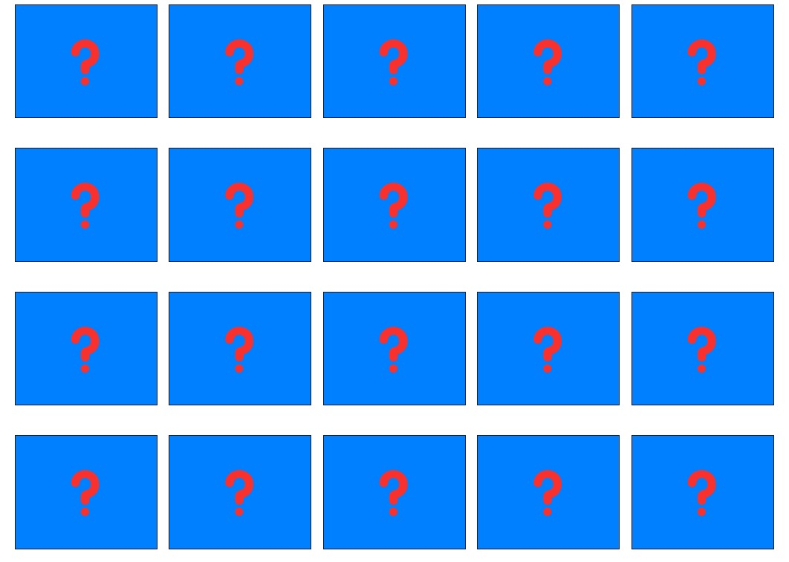
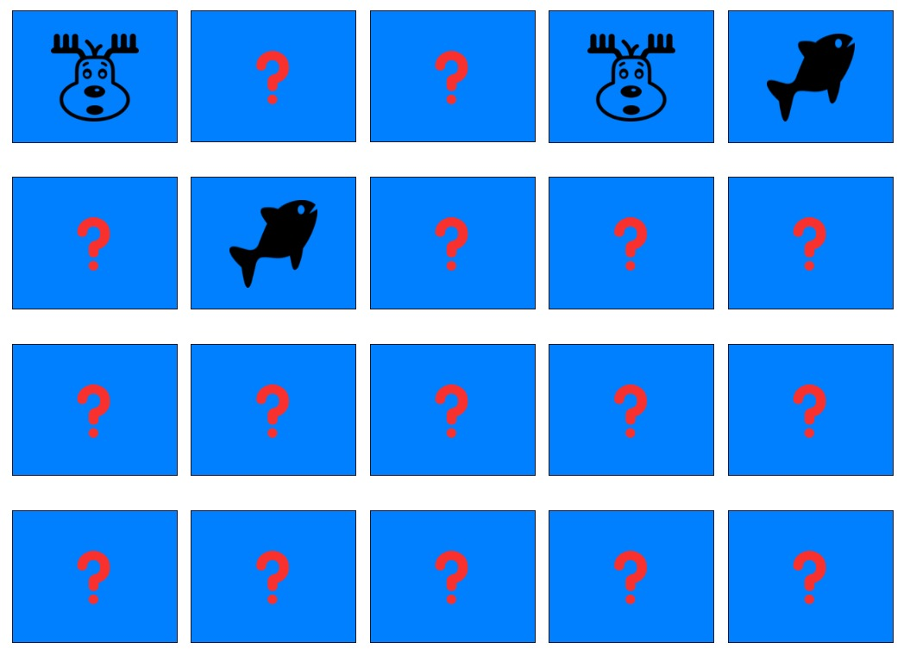
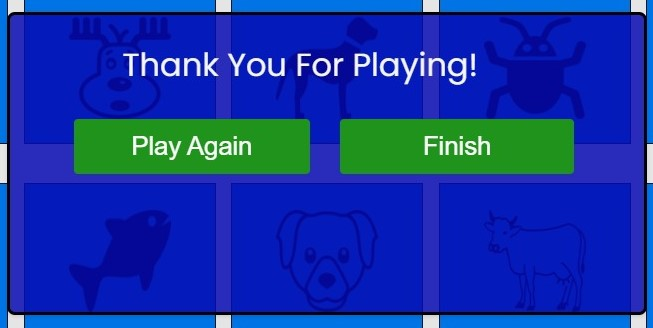
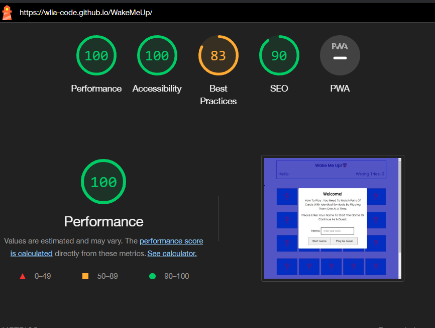

# Wake Me Up! (MemoryGame)

Welcome to the Memory Matching Game! This website is dedicated to providing a fun and challenging memory game for players of all ages.



## Purpose For This Project:

The purpose of this website is to provide an engaging memory matching game that allows players to test and improve their memory skills. The game is based on the classic "Memory" or "Concentration" game, where players must flip cards and find matching pairs.

## Features:

- **Start Game Overlay**

  - At the beginning of the game, a start game overlay is displayed, prompting the player to enter their name to start the game or play as a guest.

    

- **Player Name and Wrong Tries**

  - The header section displays the player's name and the number of wrong tries made during the game.

    

- **Game Board**

  - The main game board contains a grid of cards with different animal images. Players can click on the cards to flip them and reveal the hidden animal images.

    

- **Flipping Animation**

  - When a card is clicked, it flips over to reveal the animal image. If the two flipped cards match, they remain facing up. If they don't match, they flip back down after a brief delay.

    

- **Finish Dialog**

  - When the player successfully matches all pairs of cards, a finish dialog appears to congratulate the player and offer the option to play again or finish the game.

    

- **Responsive Design**

  - The website is designed to be responsive and compatible with various screen sizes and devices, providing an optimal gaming experience for users on desktop and mobile devices.

- **The Footer**

  - footer section includes links to My social media sites ,The links are easily accessible and will open in a new tab, allowing for seamless navigation for the user. We're active on a variety of social media platforms, so be sure to follow us for updates, tips

    

## Features Left to Implement:

- Timer and Time's Up Message
  - Introduce a countdown timer that starts when the player begins the game.
    Display a "Time's Up" message when the timer reaches zero, indicating that the game is over.
    This feature would add a sense of urgency and challenge to the game, encouraging players to match cards quickly.
- Multiple Levels with Increased Difficulty
  - Implement additional levels with an increasing number of cards and a higher level of difficulty.
- Sound Effects for Matched Cards and Wrong Tries
  - Include sound effects that play when the player successfully matches two cards with identical symbols.

## Testing:

- The Memory Matching Game was tested on the following browsers:

  - Google Chrome
  - Mozilla Firefox
  - Microsoft Edge
  - Apple Safari
  - The game worked seamlessly on all tested browsers, and the flipping animation and interactions were consistent across them.

### Bugs:

#### Solved Bugs:

- duplicated Files in Git Repository:
  - The duplicate files were removed from the Git repository using the command:
    ```bash
    git rm --cached img
    ```

#### Unsolved Bugs:

- No unsolved bugs

### Validator Testing:

- Accessibility Testing

  - No errors were returned when passing through [WAVE Evaluation Tool](https://wave.webaim.org/)

  - Accessibility second Testing Using chrome lighthouse 

- JAVASCRIPT
  - No errors were returned when passing through the official [jshint](https://jshint.com/)
- HTML
  - No errors were returned when passing through the official [W3C validator](https://validator.w3.org/nu/#textarea)
- CSS
  - No errors were found when passing through the official [(Jigsaw) validator](https://jigsaw.w3.org/css-validator/validator)

## Deployment:

- The site was deployed to GitHub pages. The steps to deploy are as follows:
  - In the GitHub repository, navigate to the Settings tab
  - From the source section drop-down menu, select the Master Branch
  - Once the master branch has been selected, the page will be automatically refreshed with a detailed ribbon display to indicate the successful deployment.

The live link can be found here - https://wlia-code.github.io/WakeMeUp/

## Credits

### Content:

- The icons in the footer were taken from [Font.Awesome](https://fontawesome.com)
- All fonts using from [fonts.google](https://fonts.google.com)

### Media:

- Website ScreenShot used on ReadMe file via [Am I Responsive](https://ui.dev/amiresponsive)
  and
  [Movavi ScreenShot Chrome Extension](https://www.screencapture.com/)

- All images used taken from [Free svg](https://freesvg.org/)
- Emoji [Get Emoji](https://getemoji.com/)
